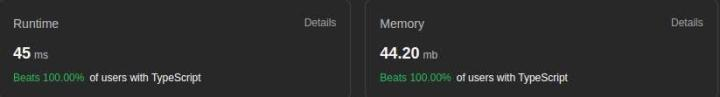

As I delve deeper into the world of data structures and algorithms through various courses, I'm challenging myself with LeetCode problems to apply what I've learned and refine my problem-solving skills. This repository is a testament to that journey, showcasing my solutions and the knowledge I've gained along the way. Feedback and suggestions are always welcome!

## **Difficulty-Based Folders:**
Easy, Medium, & Hard: Problems are categorized based on their difficulty levels as defined by LeetCode. Each difficulty level has its dedicated folder, making it straightforward to navigate and find problems of a particular challenge level.
Descriptive Solution Files:

## **Problem Statement:**
At the beginning of each solution file, I've included a detailed explanation of the challenge, ensuring that the problem's context and requirements are clear even without referring back to LeetCode.

## **Solution:**
Following the problem statement, you'll find my solution. This is not just about getting the right answer; it's about understanding the problem, applying the right data structures and algorithms, and ensuring code efficiency.

## **Testing:**
Within the solutions, there are occasional console logs, which I've used for testing and debugging. These can be handy for understanding the step-by-step logic of the solution. I might add unit testing down the line.

## **Commit Messages:**
To provide additional insights into my thought process and the efficiency of solutions, I've included the time complexity of algorithms in the commit messages. This offers a quick reference to the performance of each solution.

They are now also added at the end of every file, space complexity will be added too as I learn to calculate it.

## **Continuous Learning:**
This repository is more than just a collection of solutions. It's a reflection of my ongoing journey through various data structures and algorithms courses. As I learn and grow, I challenge myself with LeetCode problems to apply and test my knowledge.

I invite you to explore and provide feedback!
